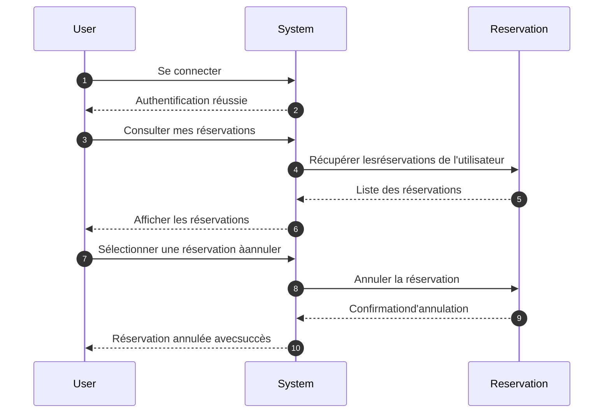
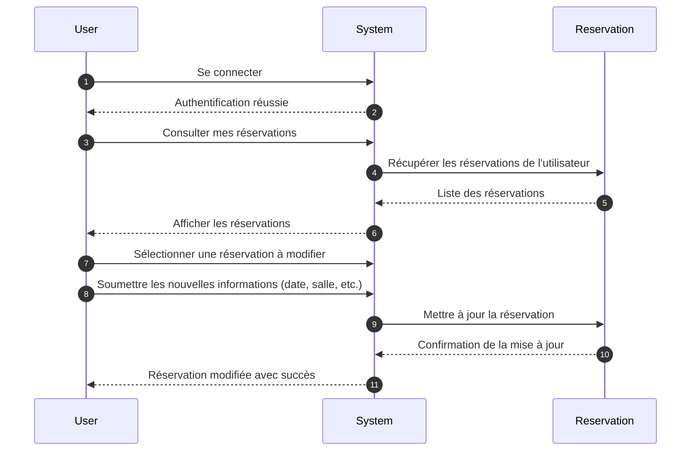
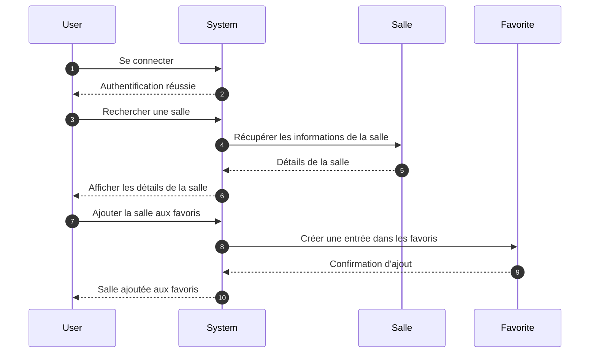
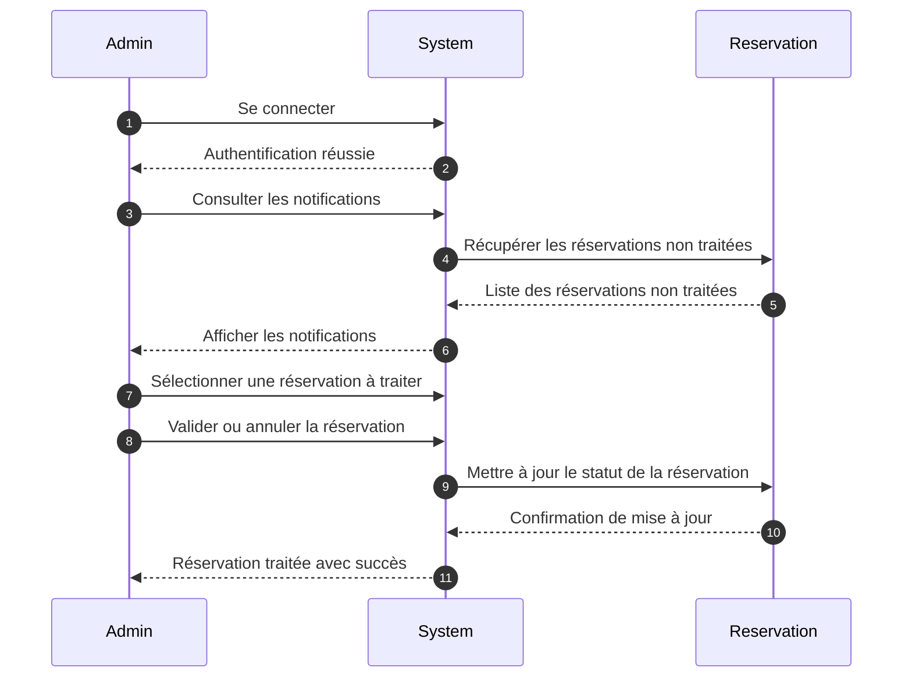
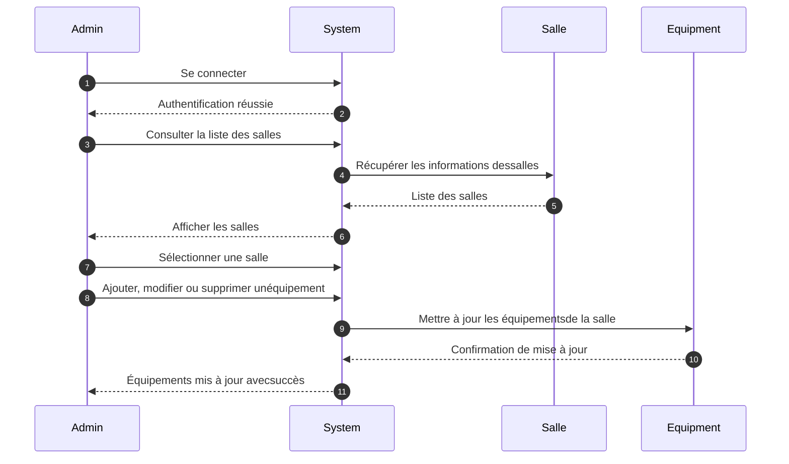
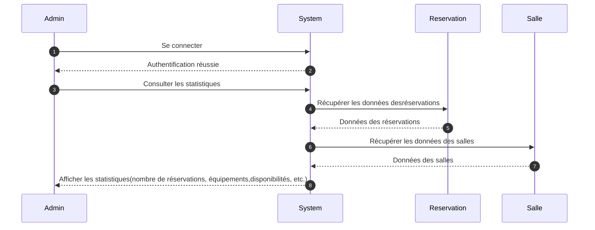

# user stories pour une application de reservation de salle .

En tant qu’utilisateur, je souhaite visiter l’application sans être obligé de me connecter, afin de me faire une idée avant de m’inscrire.
En tant qu’utilisateur, je souhaite reserver une salle, afin d'y faire un evenement.
En tant qu’utilisateur, je souhaite avoir un filtre "ergonomie"dans la recherche , afin de choisir la luminosité naturelle,accessibilité pmr,ect.
En tant qu’utilisateur, je souhaite pouvoir voir les disponnibilités des salle, afin de choisir celle qui correspond a mes dates d evenement.
En tant qu’utilisateur, je souhaite pouvoir choisir l' equipements : Filtrage en fonction des équipements disponibles (matériel,
logiciels), afin de choisir selon la disponibilité des equipements des salles.
En tant qu’utilisateur, je souhaite pouvoir prereserver une salle, afin de la valider ulteriement.
En tant qu’utilisateur, je souhaite pouvoir selectionner la capacité minimale requise d une salle, afin de m assurer que l espace sera suffisant.
En tant qu’utilisateur, je souhaite etre notifié de la validité de ma reservation, afin de m assurer de sa prise en compte.
En tant qu’utilisateur, je souhaite pouvoir modifier ou annuler ma reservation, afin de gerer mes imprevu.
En tant qu’utilisateur, je souhaite pouvoir choisir des prestations supplementaire , afin facilité mon evenement.
En tant qu’administrateur, je souhaite pouvoir gerer les salles les utilisateur et les reservation, afin de maintenir une bdd a jour.
En tant qu’administrateur, je souhaite etre notifié 5 jours avant la date de la pré-reservation non traitées, afin de repondre aux demandes (confirmé/annuler).
En tant qu’administrateur, je souhaite pouvoir valider ou annuler une pre-reservation , afin de de gérer les planning de reservation.
En tant qu’administrateur, je souhaite avoir un tableau de bord complet pour la gestion des données , afin d avoir un vision clair et simple des reservation.
En tant qu’administrateur, je souhaite avoir un code couleur sur le planning de reservation , afin de différencier les pre-reservation des reservation confirmées.
En tant qu’administrateur, je souhaite pouvoir gerer les equipements disponibles dans les salles (logiciels,materiels et critéres d ergonomie), afin de de gérer les options de reservation.
En tant qu’administrateur je souhaite mettre en place des formulaires de reservation/ pre-reservation , afin d'avoir toutes les information necessaire pour valider ou refuser une reservation.


---


## Liste priorisée de user stories

| Priorité | Rôle                 | Action                                                                | Bénéfice                                                           |
| :------: | -------------------- | --------------------------------------------------------------------- | ------------------------------------------------------------------ |
|     1    | Visiteur             | Consulter la liste des annonces                                       | Découvrir rapidement le contenu disponible                         |
|     2    | Visiteur             | Lire une annonce détaillé                                              | Approfondir la recherche d’intérêt                                     |
|     3    | Utilisateur          | S’inscrire / se connecter                                             |  Accéder aux fonctionnalités protégées |
|     4    | Utilisateur connecté | réserver ou pre-reserver une salle                                                 | s'assurer de la validité de la reservation                                      |
|     5    | Utilisateur connecté |  modifier ou annuler sa reservation                           | Gérer des imprevu ou corriger une erreur                                     |
|     6    | Utilisateur connecté       | possibilié de faire des recherches ciblées par filtre (capacitée,lieu,equipement,ergonomie,date)                | faciliter la recherche selon ses critéres                    |
|     7    | Administrateur       | Gérer les notification des reservation non traitées                 |  attirer l attention sur les reservation non traitée dont la date approche             |
|     8    | Administrateur       | Gérer les utilisateurs (rôles, blocage)                               | Contrôler l’accès et la sécurité du site                           |
|     9    | Administrateur       | Créer / éditer / supprimer une annonce via EasyAdmin      | Gérer le contenu  de manière structurée                         |
|    10    | Administrateur       | Consulter des statistiques basiques (nombre reservation, équipement, disponibilité, code couleur...) | Suivre l’activité du site  

-------------------------------------------------


Diagramme de classes (UML) — Description textuelle + explications
Classes principales :

```mermaid
classDiagram
  class User {
    - int id NN
    - dateTime created_at NN
    - dateTime updated_at NN
    - string name NN
    - string email NN
    - string password NN
    - array roles NN
    - int warning NN
    - bool banned NN
    - bool active NN
    - string location NN
    - string price NN
    - string duration NN
    }

  


  class Salle {
    - int id NN
    - string name NN
    - int capacity NN
    - text description
    - bool isAvailable NN
  }

 class Reservation {
    - int id NN
    - dateTime startDate NN
    - dateTime endDate NN
    - string status NN
    - dateTime createdAt NN
  }
 

   class Equipment {
    - int id NN
    - string name NN
    - string type NN
  }


  class CritereErgonomique {
    - int id NN
    - string name NN
  }


 
  class Favorite {
    - int id NN
    - dateTime addedAt NN
  }

 


  User "1" -- "0..*" Reservation : effectue 
  Reservation "1" -- "1" Salle : concerne  
  Salle "1" -- "*" Equipment: contient
  Salle "1" -- "*" CritereErgonomique : respecte 
  User "1" -- "0..*" Favorite : ajoute 
  Favorite "1" -- "0..1" Salle : marque 


  ```

  ---
## 📑 Sequence Diagrams

### Réserver une salle

```mermaid
sequenceDiagram
    autonumber
    User->>System: Se connecter
    System-->>User: Authentification réussie
    User->>System: Rechercher une salle (filtres : capacité, équipements, ergonomie, etc.)
    System->>Salle: Vérifier les disponibilités
    Salle-->>System: Liste des salles disponibles
    System-->>User: Afficher les salles disponibles
    User->>System: Sélectionner une salle et une date
    System->>Reservation: Créer une réservation
    Reservation-->>System: Réservation confirmée
    System-->>User: Confirmation de la réservation
```

## 📑 Sequence Diagrams

### Annuler une réservation



## 📑 Sequence Diagrams

### Modifier une reservation




  ## 📑 Sequence Diagrams

###  Ajouter une salle aux favoris




   ## 📑 Sequence Diagrams

###  Gérer les notifications des réservations non traitées (Administrateur)



  ## 📑 Sequence Diagrams

###  Gérer les équipements disponibles dans les salles (Administrateur)




  ## 📑 Sequence Diagrams

###  Consulter les statistiques (Administrateur)




