Diagramme de classes (UML) — Description textuelle + explications
Classes principales :

```mermaid
classDiagram
  class User {
    - int id NN
    - dateTime created_at NN
    - dateTime updated_at NN
    - string email NN
    - string password NN
    - array roles NN
    - int warning NN
    - bool banned NN
    - bool active NN
    
    }

    class Quotation{
    - int id NN
    - Room room NN
    - Client client NN
    - string price NN
    - string date NN
    - dateTime created_at NN
    - dateTime updated_at NN
    }

    
    class Review{
    - int star
    - string content
    - Room room
    
    }


    class Location{
    - string city
    - string department
    - string number
    - string state
    
    }

    class Client{
    - int id NN
    - string name
    - string addresse
    }

  

  class Room {
    - int id NN
    - string name NN
    - int capacity NN
    - text description
    - bool isAvailable NN
    - Room room m2m
    }

  class Booking {
    - int id NN
    - dateTime startDate NN
    - dateTime endDate NN
    - string status NN
    - dateTime created_at NN
    - Equipment equipment
    - Option option
    - Room room
    - Client client


  }
 

   class Equipment {
    - int id NN
    - string name NN
    - string type NN
    - Room room m2m
  }


  class Option {
    - int id NN
    - string name NN
    - Room room m2m
  }


 
  class Favorite {
    - int id NN
    - Room room
    - User user

  }

 


  
  User "1" -- "0..*" Booking : effectue 
  User "1" -- "1" Client : possede 
  User "1" -- "0..*" Quotation : reçoit 
  Room "1" -- "0..*" Quotation : concerne 
  Booking "1" -- "1" Room : concerne  
  Review "0..*" -- "1" Room : reçoit
  Room "*" -- "*" Equipment: contient
  Booking "*" -- "*" Equipment: contient
  Room "1" -- "1" Location: situé
  Room "*" -- "*" Option : respecte 
  Booking "*" -- "*" Option : respecte 
  User "1" -- "0..*" Favorite : ajoute 
  Favorite "0..*" -- "1" Room : marque 


  ```

  ---
## 📑 Sequence Diagrams

### Réserver une salle

```mermaid
sequenceDiagram
    autonumber
    User->>System: Se connecter
    System-->>User: Authentification réussie
    User->>System: Rechercher une salle (filtres : capacité, équipements, ergonomie, etc.)
    System->>Salle: Vérifier les disponibilités
    Salle-->>System: Liste des salles disponibles
    System-->>User: Afficher les salles disponibles
    User->>System: Sélectionner une salle et une date
    System->>Reservation: Créer une réservation
    Reservation-->>System: Réservation confirmée
    System-->>User: Confirmation de la réservation
```

## 📑 Sequence Diagrams

### Annuler une réservation

```mermaid
sequenceDiagram
    autonumber
    User->>System: Se connecter
    System-->>User: Authentification réussie
    User->>System: Consulter mes réservations
    System->>Reservation: Récupérer lesréservations de l'utilisateur
    Reservation-->>System: Liste des réservations
    System-->>User: Afficher les réservations
    User->>System: Sélectionner une réservation àannuler
    System->>Reservation: Annuler la réservation
    Reservation-->>System: Confirmationd'annulation
    System-->>User: Réservation annulée avecsuccès
```



## 📑 Sequence Diagrams

### Modifier une reservation

```mermaid
sequenceDiagram
    autonumber
    User->>System: Se connecter
    System-->>User: Authentification réussie
    User->>System: Consulter mes réservations
    System->>Reservation: Récupérer les réservations de l'utilisateur
    Reservation-->>System: Liste des réservations
    System-->>User: Afficher les réservations
    User->>System: Sélectionner une réservation à modifier
    User->>System: Soumettre les nouvelles informations (date, salle, etc.)
    System->>Reservation: Mettre à jour la réservation
    Reservation-->>System: Confirmation de la mise à jour
    System-->>User: Réservation modifiée avec succès   
 
```




  ## 📑 Sequence Diagrams

###  Ajouter une salle aux favoris
//verifier si salle est User.Favoris alors retirer sinon ajouter

```mermaid
sequenceDiagram
    autonumber
    User->>System: Se connecter
    System-->>User: Authentification réussie
    User->>System: Rechercher une salle
    System->>Salle: Récupérer les informations de la salle
    Salle-->>System: Détails de la salle
    System-->>User: Afficher les détails de la salle
    User->>System: Ajouter la salle aux favoris
    System->>Favorite: Créer une entrée dans les favoris
    Favorite-->>System: Confirmation d'ajout
    System-->>User: Salle ajoutée aux favoris

  
```




   ## 📑 Sequence Diagrams

###  Gérer les notifications des réservations non traitées (Administrateur) 
// a voir plus tarddeclencheur eventlistener reservation moins de 6 et non traitée il envoi notif

```mermaid
sequenceDiagram
    autonumber
    Admin->>System: Se connecter
    System-->>Admin: Authentification réussie
    Admin->>System: Consulter les notifications
    System->>Reservation: Récupérer les réservations non traitées
    Reservation-->>System: Liste des réservations non traitées
    System-->>Admin: Afficher les notifications
    Admin->>System: Sélectionner une réservation à traiter
    Admin->>System: Valider ou annuler la réservation
    System->>Reservation: Mettre à jour le statut de la réservation
    Reservation-->>System: Confirmation de mise à jour
    System-->>Admin: Réservation traitée avec succès


```



  ## 📑 Sequence Diagrams

###  Gérer les équipements disponibles dans les salles (Administrateur)

```mermaid
sequenceDiagram
    autonumber

Admin->>System: Se connecter
System-->>Admin: Authentification réussie
Admin->>System: Consulter la liste des salles
System->>Salle: Récupérer les informations dessalles
Salle-->>System: Liste des salles
System-->>Admin: Afficher les salles
Admin->>System: Sélectionner une salle
Admin->>System: Ajouter, modifier ou supprimer unéquipement
System->>Equipment: Mettre à jour les équipementsde la salle
Equipment-->>System: Confirmation de mise à jour
System-->>Admin: Équipements mis à jour avecsuccès
```




  ## 📑 Sequence Diagrams

###  Consulter les statistiques (Administrateur)

```mermaid
sequenceDiagram
    autonumber
Admin->>System: Se connecter
System-->>Admin: Authentification réussie
Admin->>System: Consulter les statistiques
System->>Reservation: Récupérer les données desréservations
Reservation-->>System: Données des réservations
System->>Salle: Récupérer les données des salles
Salle-->>System: Données des salles
System-->>Admin: Afficher les statistiques(nombre de réservations, équipements,disponibilités, etc.)
```




